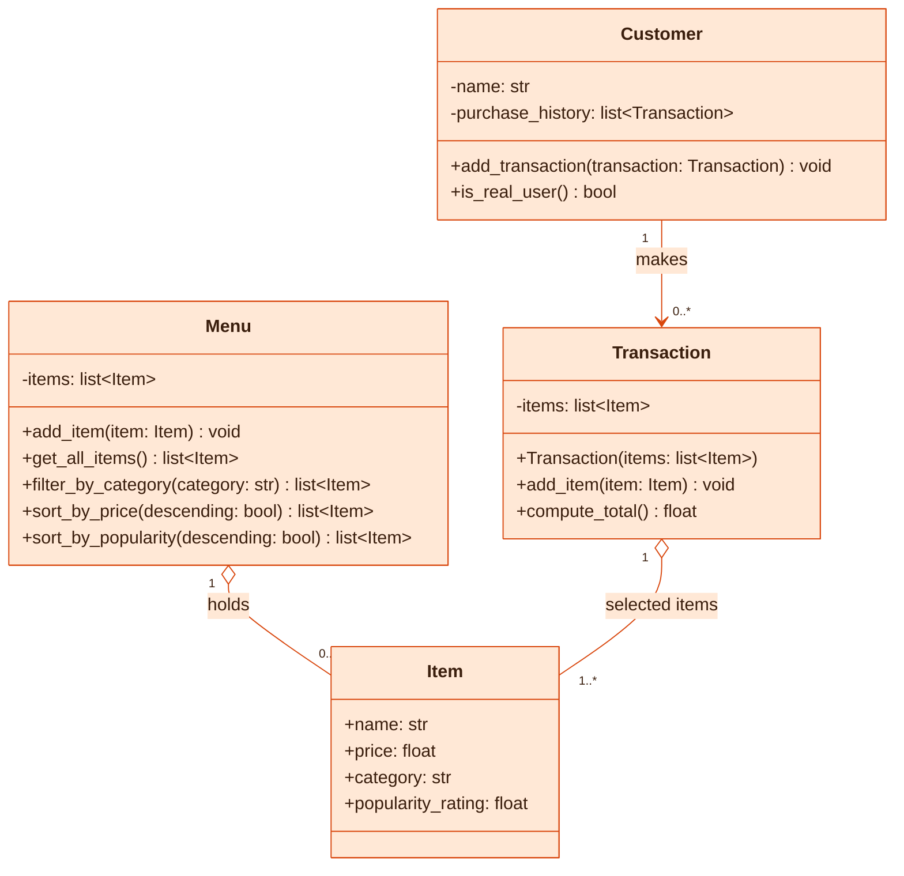

# ByteBites Class Diagram (Revised)

```mermaid
%%{init: {'theme': 'base', 'themeVariables': {'primaryColor': '#FFE8D6', 'primaryBorderColor': '#D9480F', 'primaryTextColor': '#3B1F0E', 'lineColor': '#D9480F', 'fontFamily': 'arial'}}}%%
classDiagram
    class Customer {
        -name: str
        -purchase_history: list~Transaction~
        +add_transaction(transaction: Transaction) void
        +is_real_user() bool
    }

    class Item {
        +name: str
        +price: float
        +category: str
        +popularity_rating: float
    }

    class Menu {
        -items: list~Item~
        +add_item(item: Item) void
        +get_all_items() list~Item~
        +filter_by_category(category: str) list~Item~
        +sort_by_price(descending: bool) list~Item~
        +sort_by_popularity(descending: bool) list~Item~
    }

    class Transaction {
        -items: list~Item~
        +Transaction(items: list~Item~)
        +add_item(item: Item) void
        +compute_total() float
    }

    Customer "1" --> "0..*" Transaction : makes
    Menu "1" o-- "0..*" Item : holds
    Transaction "1" o-- "1..*" Item : selected items
```

## How to Read This Diagram

| Symbol | Meaning |
|---|---|
| `1` | exactly one |
| `0..*` | zero or more |
| `1..*` | one or more |
